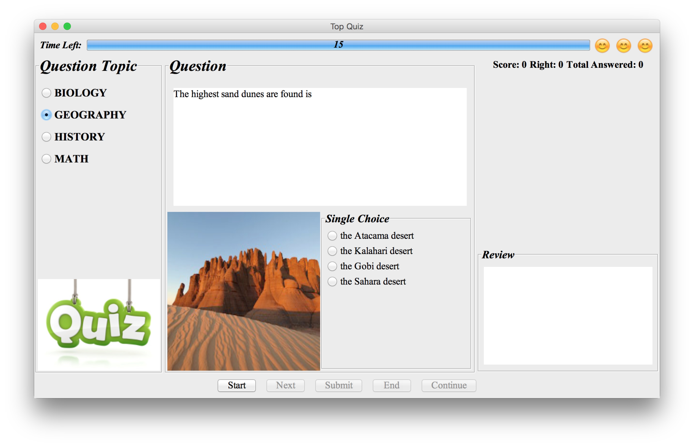
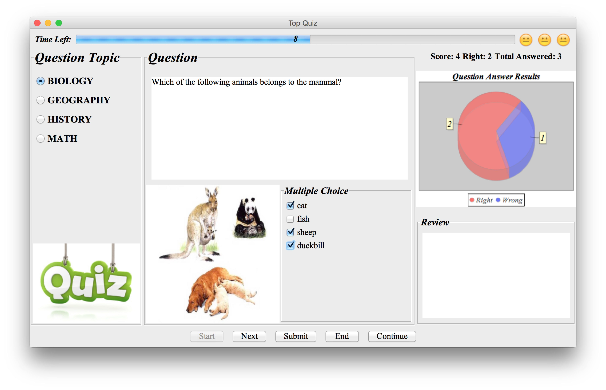
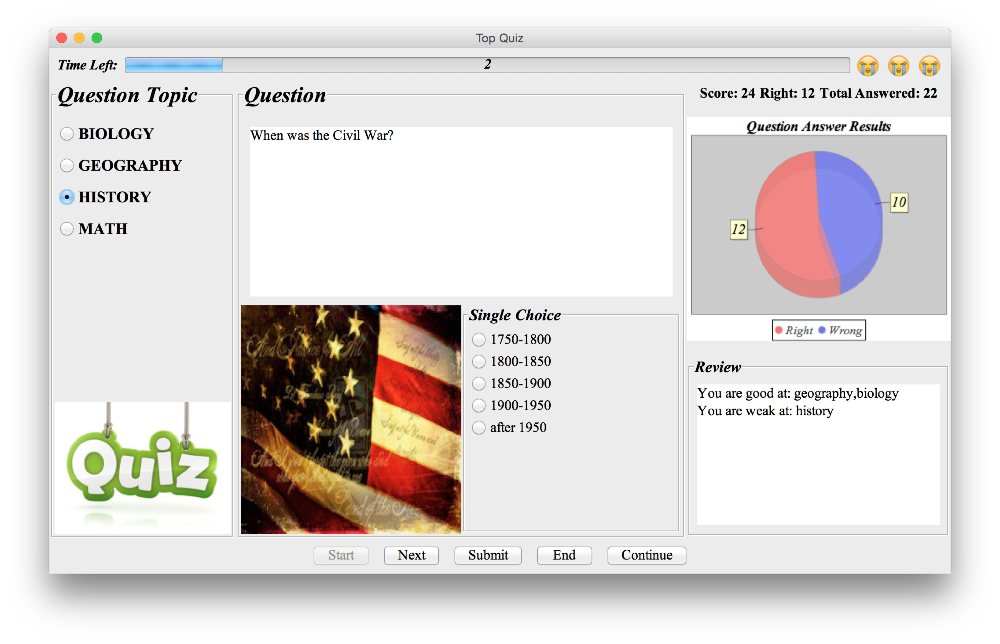
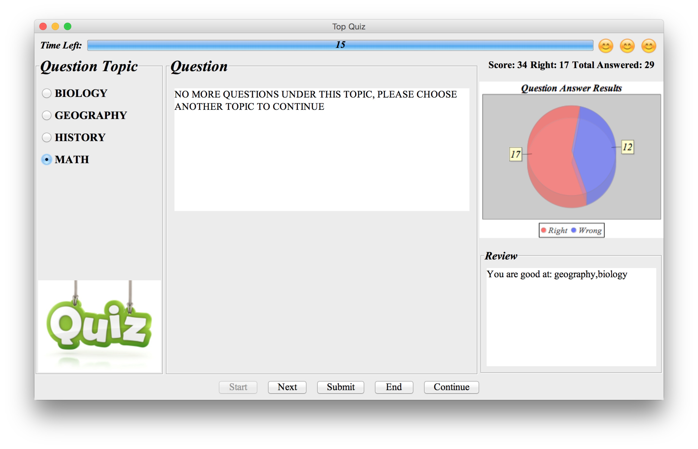
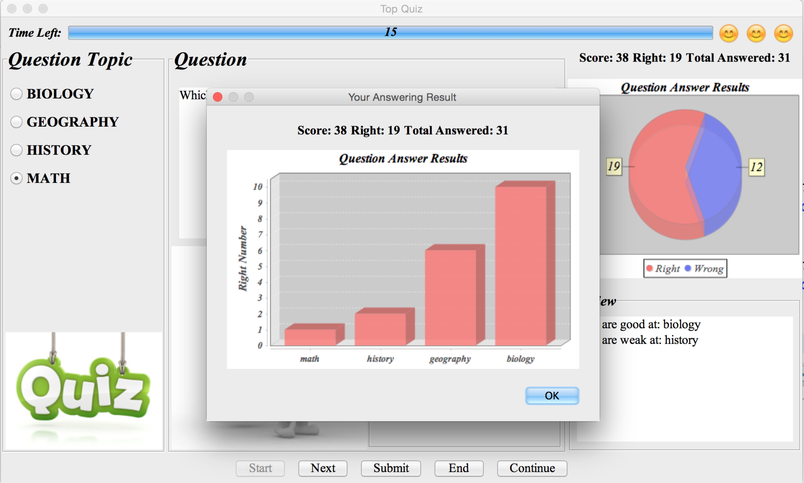

# Top Quiz

This is an interactive game which is developed based on Java Swing.

# Description
* Select any one of the given topic and start the quiz.
* There are different question answer types including single choice, multiple choices and blank filling.
* Answer questions in a limited time, and the score and assessment are shown according to your answers.
* There will be a reminder if all the questions in one topic have been answered.
* When you end the quiz, there will be a dialog with a bar graph showing your score distribution. 

# Dependency
* [JFreechart](http://www.jfree.org/jfreechart/)
* JSON

# Screenshots

